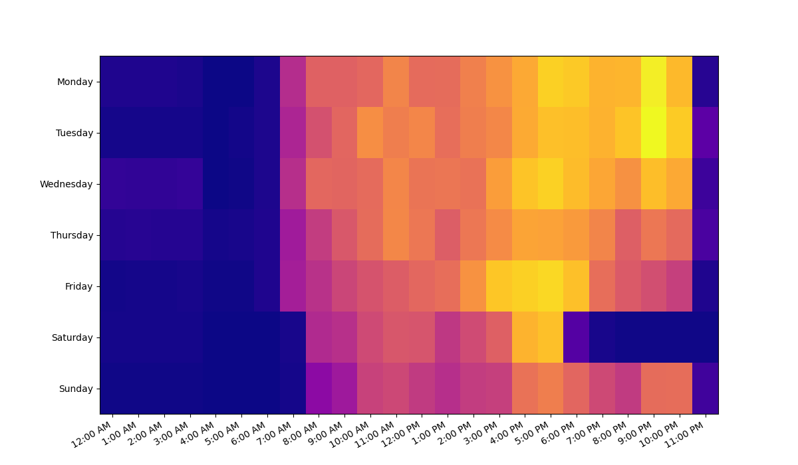

# RSF Analytics

Heatmap of RSF weight room density. Originally made freshman year with [@AlexanderMcDowell](https://github.com/AlexanderMcDowell), and eventually thought I'd turn it into a site.



## Development (Site)

Install deps:

```bash
cd site/
poetry install
```

Run dev server:

```bash
source /path-to-poetry-env/bin/activate
hypercorn main.py -b 127.0.0.1:8000 --reload
```

Build container:

```bash
CONTAINER_NAME=ghcr.io/turtlebasket/rsf-analytics
docker build . -t $CONTAINER_NAME
```

Run container:

```bash
source .env && docker run -t -i --env-file=.env -p 8000:8000 $CONTAINER_NAME:latest
```
